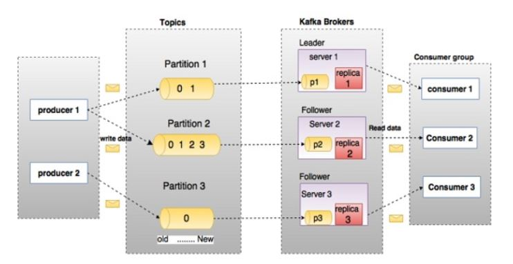
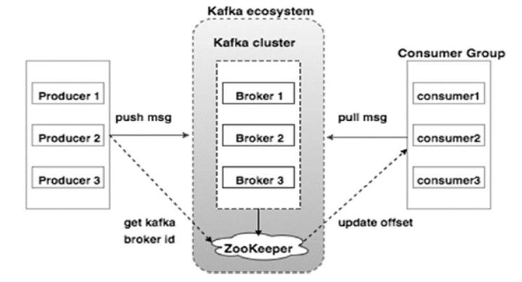

# ApacheKakfaExample
Very basic example of apache kafka producer &amp; consumer using java api of kafka client.

## Kafka fundamentals 

## Kafka cluster architecture

## Install

 - Install **zookeeper** @ http://zookeeper.apache.org/releases.html
 - Install **kafka** @ https://www.apache.org/dyn/closer.cgi?path=/kafka/0.9.0.0/kafka_2.11-0.9.0.0.tgz

## Run

 - Start zookeeper using command `bin/zookeeper-server-start.bat`
 - Start kafka broker using command `bin/kafka-server-start.bat config/server.properties`
 - Create a simple topic using command `bin/kafka-topics.sh --create --zookeeper localhost:2181 --replication-factor 1 
--partitions 1 --topic topic-name`
 - Now run the class `SimpleProducer.java`  while passing this topic name in arugments.
 - Then run the class `SimpleConsumer.java` passing the same topic name to consume the messages pushed by the `SimpleProducer` class.   